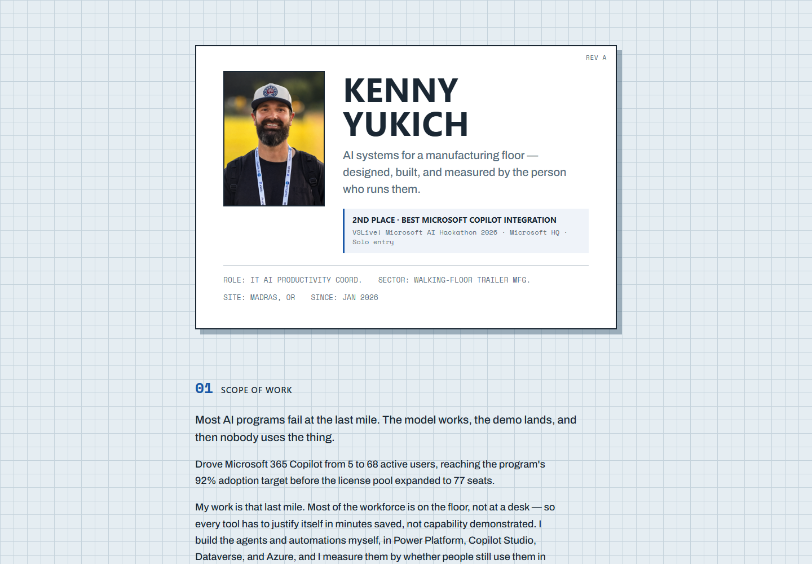
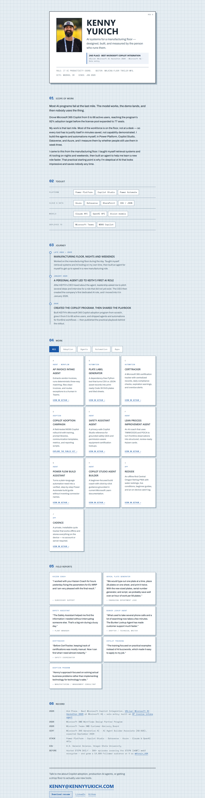
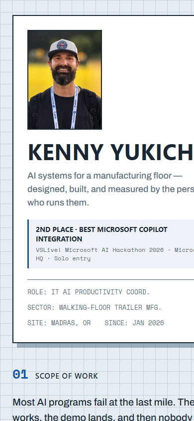

# KennyYukich.com — Cloud Solution Architect (Copilot) fit audit

Date: 2026-08-27

Target role: [Cloud Solution Architect — Copilot, Microsoft](https://apply.careers.microsoft.com/careers/job/1970393556866184)

## Verdict

Overall grade: **B- (7.0/10)**

The site already makes Kenny look like a credible, unusually practical AI builder with real adoption results. For this specific role, however, it presents him more strongly as an internal hands-on operator than as a customer-facing Cloud Solution Architect who discovers needs, leads architecture, influences decision-makers, partners across teams, and ties the work to ROI.

The site is likely to create interest, but it leaves the recruiter to infer several of the role's most important qualifications.

## Scorecard

| Area | Grade | Assessment |
|---|---:|---|
| Positioning and distinctiveness | A- | The manufacturing-floor and “last mile” point of view is memorable and credible. |
| Proof and outcomes | B+ | Adoption metrics, testimonials, and the Microsoft HQ hackathon create trust. |
| Match to the target role | C+ | Copilot and agent expertise is evident; customer advising, architecture leadership, ROI, and cross-functional influence are not explicit enough. |
| Recruiter usability | C+ | The page is scannable on desktop, but the artificial loader, long project grid, and broken resume link add friction. |
| Visual design | B | The technical drawing language is distinctive and cohesive on desktop. Mobile overflow materially hurts polish. |
| Accessibility | B- | Strong general contrast and visible focus styles; heading semantics, one borderline text color, loading behavior, and mobile reflow need work. |

## Captured flow

### Step 1 — Initial page load: needs work

The visitor is blocked by a decorative percentage loader before seeing Kenny or his value. Recruiters often scan quickly; this creates delay without building trust. Reduced-motion users bypass it, which is good, but the best hiring experience is to remove it for everyone.

### Step 2 — Desktop first scan: healthy

The portrait, name, Microsoft-related award, and quantified 5-to-68-user result create a strong first impression. The headline is distinctive but narrowly frames Kenny as a manufacturing-floor builder. There is no immediate recruiter action such as “View flagship case study” or “Download resume.”

### Step 3 — Evidence trail and conversion: mixed

The page has substantial evidence: toolkit, career story, ten projects, user quotes, credentials, and contact details. The work grid gives every project similar weight, so the most role-relevant proof is buried. The resume control points to `resume.pdf`, but that file is absent, making the primary hiring conversion broken.

### Step 4 — Mobile first scan: unhealthy

The portrait renders sharply, but the name, hero copy, award details, and card extend beyond the right edge. This creates horizontal clipping at a common 390px mobile viewport and makes the page feel unfinished.

## What already works

- The clearest proof is excellent: Microsoft 365 Copilot grew from 5 to 68 active users and reached a 92% adoption target.
- The “last mile” thesis aligns well with Microsoft's emphasis on sustained usage, adoption, and business-value realization.
- Copilot Studio, M365 Copilot, Power Platform, Dataverse, and Azure are all visible without keyword stuffing.
- The Microsoft HQ hackathon result is prominent and gives third-party credibility.
- Field reports demonstrate actual use and customer value rather than demo-only work.
- The visual system is original, professional, and consistent on desktop.

## Highest-impact gaps

1. **The hero does not name the target value proposition.** It should connect Copilot and agentic AI to measurable business value, adoption, and solution architecture—not only manufacturing execution.
2. **There is no flagship case study.** A recruiter needs one complete story showing discovery, stakeholders, architecture, security/governance choices, rollout, adoption work, measurement, and ROI.
3. **Customer-facing leadership is implicit.** The role explicitly values trusted advising and engagement with business and technical decision-makers. The site should state workshops led, stakeholders influenced, requirements gathered, objections resolved, and teams partnered with.
4. **Architecture depth is mostly a tool list.** Show how M365 Copilot, Copilot Studio, Power Platform, Dataverse, Azure, Teams, identity, permissions, data, monitoring, and human review fit together in a real solution.
5. **The project grid dilutes the candidacy.** Redside, Cadence, and lower-priority tools prove range but compete with Copilot adoption, agent architecture, and business-value evidence.
6. **The hiring path is broken.** `resume.pdf` is not present. There is also no prominent resume or contact CTA near the top.
7. **Mobile reflow fails.** The hero's minimum content width exceeds the viewport.

## Recommended content direction

### Revised hero

**Headline:** Copilot and agentic AI solutions that turn operational problems into measurable business value.

**Support:** I design, build, and drive adoption for Microsoft 365 Copilot, Copilot Studio, Power Platform, and Azure solutions—growing one program from 5 to 68 active users and reaching 92% adoption.

Add two immediate actions: **View flagship case study** and **Download resume**.

### Flagship case study structure

Use the Copilot adoption program as the primary story:

1. Customer and operational challenge
2. Business and technical stakeholders
3. Discovery and success measures
4. Solution and governance architecture
5. Adoption and change-management plan
6. Obstacles and decisions
7. Quantified result and sustained usage
8. Reusable assets, playbook, or IP created

Follow it with two smaller case studies: a production agent and an automation with a hard time/ROI result.

### Role-fit evidence block

Make these facts explicit if accurate:

- Years in customer-facing or internal-consulting work
- Years leading technical projects
- Executive, operations, IT, security, and frontline stakeholders advised
- Workshops, demos, training sessions, or discovery sessions led
- Architecture, governance, identity, permission, and monitoring responsibilities
- Business value measured: hours saved, cycle-time reduction, error reduction, adoption, or cost avoidance
- Degree, current certifications, work authorization, and willingness to travel

## Recommended priority

### Do first

1. Remove the artificial loader.
2. Fix the mobile hero overflow.
3. Add the missing resume and make the resume/contact actions visible in the hero.
4. Rewrite the hero around business value, adoption, architecture, and trusted advising.
5. Turn the Copilot adoption work into one full case study above the project grid.

### Do next

6. Feature only the three most role-relevant projects; move the rest into a compact “More builds” list.
7. Attach the strongest field report to each featured case study.
8. Add role-fit facts about stakeholder leadership and customer-facing experience.
9. Convert section labels into real `h2` headings and add a skip link.
10. Slightly darken normal-size steel text on the light background; the current `#586F81` on `#E5EDF2` is approximately 4.43:1, just below the WCAG AA 4.5:1 threshold for normal text.

## Evidence limits

This audit used local Chrome screenshots at 1440px desktop and 390px mobile, plus source inspection for interactions and semantics. It did not test every external GitHub link, screen reader output, browser/OS combination, zoom level, or real recruiter behavior. It does not claim full WCAG compliance.
